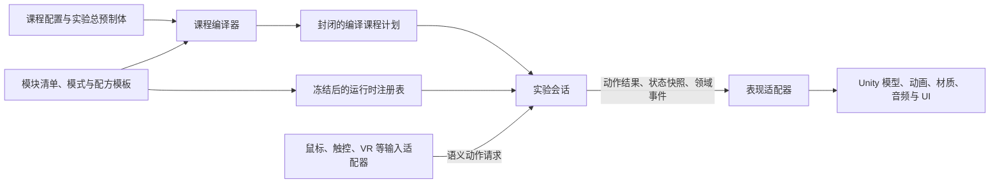

# 虚拟实验引擎架构边界设计

状态：提案，作为下一轮收敛工作的边界基线；本文不要求立即修改运行时代码。

## 1. 目标

本设计解决三个问题：

1. 内核最少需要知道什么；
2. 交互、化学、教学评价等模块如何注册自己的词汇和行为；
3. 具体课程如何只通过配置实例化已有能力，而不反向要求内核增加定义。

最终应满足以下判断标准：

- 新增同类器材，只增加实体和组件实例，不复制规则；
- 新增实验，只修改课程配置和实验总预制体，不修改内核；
- 新增学科行为，只新增或修改对应模块，不修改最小内核；
- 模块增加新能力时，课程基础表头不扩列；
- 编译完成后，运行时不再解析 CSV、选择器或配方模板；
- 表现失败不能改变科学状态，科学状态变化必须经过原子事务。

## 2. 结论

目标架构分为“最小内核、模块契约、课程模型、适配与表现”四层。



依赖只能向内：

```text
课程与适配器 -> 模块 -> 最小内核
```

最小内核不得引用模块、课程、Unity 或具体学科。模块不得引用具体课程实体 ID。课程不得声明未由模块注册的新协议类型。

## 3. 当前边界问题

当前实现已经具有实体、关系、事实读取器、状态操作注册表、配方和课程编译等正确基础，但定义所有权仍不够清晰。

| 当前定义 | 问题 | 目标归属 |
| --- | --- | --- |
| `Temperature`、物质库存和物态 | 学科含义进入通用运行时 | 测量或化学模块 |
| `InteractionCapabilityIds` | 已迁入 `VirtualLab.Interaction`，Domain 只保留通用能力机制 | 保持独立交互程序集所有权 |
| `InteractionSemanticActionIds` | 已迁入 `VirtualLab.Interaction`，输入适配器直接引用交互动作协议 | 保持独立交互程序集所有权 |
| `RelationKind` 固定枚举 | 新模块增加关系时必须修改通用程序集 | 内核保留关系机制，关系类型由模块注册 |
| `StructuredFactField` 上的具体静态字段 | 事实种类由通用层集中持有 | 内核保留事实标识类型，字段由模块注册 |
| `课程进度` 标量 | 用一个数字代替多种领域状态 | 模块注册的命名状态 |
| 实验对象表的倾倒、加热、覆盖等横向列 | 新模块会持续增加表头 | 纵向组件实例及其类型化参数 |
| 课程规则绑定具体实体 ID | 增加同类器材需要复制规则 | 类型、角色或标签选择器 |
| `可抓取` 后再用规则禁用 | 能力、操纵约束和课程许可混在一起 | 交互组件直接声明固定或受限操纵 |

严格按当前程序集看，`Runtime/Kernel` 已经较小；需要继续收敛的是通用 `Domain/Application` 中仍持有的交互、物质和课程词汇，而不是简单删除所有类型。

## 4. 内核最小契约

### 4.1 内核保留的概念

最小内核只保留执行任何学科实验都需要的机制。

#### 标识与类型化值

- `EntityId`：实体实例标识；
- `ModuleId`：模块标识；
- `ComponentTypeId`：组件类型标识；
- `ActionTypeId`：动作类型标识；
- `RelationTypeId`：关系类型标识；
- `FactTypeId`：事实类型标识；
- `StateTypeId`：状态类型标识；
- `OperationTypeId`：原子状态操作标识；
- `EventTypeId`：事件类型标识；
- `ProcessTypeId`：持续过程类型标识；
- `TypedValue`：空值、布尔、整数、数值、文本、实体标识和结构化值；
- `MeasureValue`：数值与单位标识的组合，但不在内核解释摄氏度、克或毫升的换算关系。

标识本身是稳定协议，不需要中英文转换词典。推荐直接使用有所有权前缀的中文标识，例如：

```text
交互.动作.抓取
交互.关系.持有
化学.事实.来源温度
教学.后果.需要重新开始
```

内部协议不使用 `.vN` 后缀。破坏性变化通过包版本和编译期迁移处理，不在运行时保留旧协议分支。

#### 权威世界状态

- 实体及其组件实例；
- 按 `StateTypeId` 存储的类型化状态；
- 通用关系图；
- 活动持续过程；
- 确定性仿真 Tick；
- 已发布事件序列。

内核不理解“试管”“氧气”“盖子已打开”等含义，只保证状态结构合法、写入可验证、回放确定。

#### 动作与规则执行

- 动作请求：命令 ID、操作者、来源、目标、动作类型和参数；
- 动作候选：动作适用范围、优先级、要求和结果计划；
- 事实读取协议；
- 类型化比较运算；
- 接受、拒绝及全部拒绝证据；
- 动作可用性查询与正式执行使用同一规则链。

比较器保留通用集合：相等、不等、空、非空、包含及数值大小比较。模块可以注册新的类型专用比较器，但不能绕过类型检查。

#### 原子状态事务

- 动作的全部状态操作要么一起成功，要么全部回滚；
- 状态操作必须先由注册表解析并验证参数模式；
- 同一事务中的事件在状态提交后才发布；
- 幂等操作应明确声明幂等性；
- 冲突、越界、单位不一致和非法关系必须返回结构化证据。

#### 关系机制

内核保留关系记录和索引，但不保留固定的 `RelationKind` 枚举。关系类型由模块注册，并同时声明约束：

- 是否有方向；
- 来源和目标允许的组件类型；
- 来源或目标是否唯一；
- 是否使用端口；
- 是否允许同一关系重复设置；
- 删除时是否要求关系必须存在。

例如“持有关系来源唯一”“覆盖关系目标唯一”“连接关系端口唯一”都应是交互模块注册的数据约束，而不是内核中的关系名称分支。

#### 确定性过程和事件

- 过程实例的开始、停止、推进和快照；
- 同 Tick 内稳定的执行顺序；
- 类型化事件载荷；
- 存档、恢复和重放所需的纯数据快照。

### 4.2 内核明确不保留的内容

- 抓取、放置、覆盖、夹持、连接等动作名称；
- 容器、可燃、可观察、可破损等能力名称；
- 物质、温度、反应、倾倒、加热和集气规则；
- Unity 资源路径、预制体、锚点、材质或音频类型；
- 教学目标、评分维度、提示文案和后果严重度枚举；
- CSV 表头、紧凑参数字符串和课程选择器；
- 任何具体课程实体 ID；
- 为旧协议提供的兼容词典或版本化事件分支。

### 4.3 内核不变量

以下不变量不能下放给课程：

1. 标识和注册项不可为空或重复；
2. 注册表冻结后不可修改；
3. 未注册协议不能进入编译计划；
4. 状态值必须符合注册模式；
5. 事务失败不得留下部分状态和部分事件；
6. 相同输入、初始状态和 Tick 序列必须得到相同结果；
7. 查询动作可用性不得改变状态；
8. 表现执行器不得直接写入权威世界；
9. 模块关系约束必须在设置关系前统一验证；
10. 编译计划必须是封闭且可序列化的纯数据。

## 5. 模块注册契约

### 5.1 模块清单

每个模块必须提供一份清单：

| 字段 | 含义 |
| --- | --- |
| 模块标识 | 稳定且全局唯一，例如 `交互`、`化学`、`教学` |
| 显示名称 | 给创作工具展示的自然语言名称 |
| 包版本范围 | 用于安装和编译期兼容检查，不进入协议 ID |
| 依赖模块 | 明确依赖及最低版本 |
| 运行时注册入口 | 注册事实、操作、过程、事件投影等 |
| 创作期注册入口 | 注册组件模式、动作模板、配置校验和总览生成器 |
| 可选适配入口 | 注册 Unity 表现或输入适配器，不得成为科学运行时依赖 |

课程编译产物必须显式声明所需模块。创作期由课程选择的平台、学科配方包提供者汇总该声明，避免在课程表中重复维护模块列表。禁止通过扫描程序集隐式决定课程行为，避免同一课程因安装环境不同而得到不同结果。

### 5.2 模块可注册的契约

| 注册表 | 模块注册内容 | 示例 |
| --- | --- | --- |
| 组件模式 | 组件 ID、参数模式、默认值和约束 | `交互.操纵约束`、`化学.容器` |
| 动作模式 | 动作 ID、参数模式和语义角色 | `交互.动作.覆盖` |
| 关系模式 | 关系 ID、端点和唯一性规则 | `交互.关系.覆盖` |
| 状态模式 | 状态 ID、值类型、单位和写入权限 | `化学.状态.温度` |
| 事实读取器 | 从动作上下文和世界读取类型化值 | `化学.事实.来源温度` |
| 能力状态编解码 | 按能力 ID 保存和恢复模块专用结构 | `交互.能力.连接器`的端口状态 |
| 状态操作 | 白名单原子写入及参数模式 | `化学.操作.转移物质` |
| 持续过程 | 确定性推进处理器 | `化学.过程.受热分解` |
| 事件模式 | 事件 ID 和载荷模式 | `化学.事件.气体已生成` |
| 动作模板 | 组件匹配、要求、结果和默认表现信号 | “可覆盖源 + 可覆盖目标” |
| 教学投影 | 将动作和领域事件投影为目标、评分和后果证据 | “安全事故阻断目标” |
| 表现语义 | 与科学状态解耦的表现信号契约 | “连接完成”“液位变化” |

### 5.3 注册生命周期

1. 读取编译课程声明的模块列表；
2. 解析依赖并按拓扑顺序创建模块作用域；
3. 模块向独立构建器注册契约；
4. 检查 ID 冲突、依赖缺失、模式冲突和循环依赖；
5. 冻结注册表；
6. 编译课程选择器和模板；
7. 验证编译计划只引用已注册契约；
8. 创建会话所需的运行时服务实例。

注册表必须是会话或编译上下文拥有的对象，避免可变的全局静态注册导致测试和课程之间串状态。

### 5.4 所有权规则

- 只有拥有标识前缀的模块可以注册和修改该协议；
- 其他模块只能通过显式依赖引用该协议；
- 重复 ID 直接导致编译失败，不允许最后注册者覆盖；
- 模块代码不能引用具体课程实体 ID；
- 模块可以提供默认动作模板，课程只能实例化、收紧或替换表现；
- 不可弱化的安全要求不能被课程删除；
- 课程不能用任意脚本或反射注册状态操作；
- 模块卸载或升级后必须重新编译课程，不保留运行时兼容分支。

### 5.5 建议的模块拆分

| 模块 | 拥有的主要定义 |
| --- | --- |
| 交互 | 操纵约束、抓取、持有、放置、覆盖、端口连接、夹持、接触和空间事实 |
| 测量 | 单位模式、量值兼容和显式换算 |
| 化学 | 物质库存、物态、容器内容、温度、倾倒、加热、燃烧、集气和反应 |
| 教学 | 教学目标、评分、提示、后果严重度、可恢复性和目标阻断 |
| 表现语义 | 与设备无关的表现信号和目标定位契约 |
| Unity 适配 | 输入手势、实体视图、资源加载、锚点、动画、材质、音频和 UI 执行器 |

`Unity 适配`不是科学模块，不能注册物质变化或修改实验权威状态。

## 6. 课程配置模型

### 6.1 课程配置的职责

课程只做以下事情：

- 选择平台与学科配方包，由编译器生成明确的所需模块声明；
- 声明实体实例、类型、角色和标签；
- 为实体挂载已注册组件并填写参数；
- 选择模块提供的动作或过程模板；
- 用实体、类型、角色或标签选择器收紧课程规则；
- 声明初始状态、初始关系和资源路径；
- 声明教学目标、后果、评分和提示；
- 声明表现覆盖；
- 提供独立的验收场景。

课程不能定义新的事实读取器、状态操作、持续过程处理器或关系约束。如果课程需要这些内容，说明它应成为模块能力。

### 6.2 创作模型与编译模型分离

创作模型面向人，允许类型、角色、标签、模板和紧凑参数。编译模型面向运行时，必须把所有选择器和模板展开成确定的实体实例计划。

| 创作模型 | 编译模型 |
| --- | --- |
| `类型=玻璃片` | `玻璃片一`、`玻璃片二` 两个实体定义 |
| `角色=集气瓶盖片` | 四组明确的覆盖动作候选 |
| `模板=交互.模板.兼容覆盖` | 具体规则、关系操作和结果组 |
| `固定器材` 组件 | 不生成可移动操作，或生成明确拒绝策略 |
| 教学后果选择器 | 具体目标、评分和阻断定义 |

运行时不得重新匹配“所有玻璃片”或解释课程模板。

### 6.3 稳定的基础表

建议课程源文件按职责保持以下稳定结构。表的数量不是优化目标；表头不随模块增加才是收敛目标。

#### `课程.csv`

```text
课程标识,显示名称,学科配方包,操作者实体标识,实验预制体
```

所需模块由已选择的配方包提供者写入编译产物，不在课程表中再次手填，避免配方能力与模块声明漂移。

#### `实体.csv`

```text
实体标识,显示名称,实体类型,角色列表,标签列表,初始位置,初始旋转
```

实体类型用于继承默认组件，角色用于课程语义选择，标签用于横切分类。三者不能互相替代。

#### `组件.csv`

```text
组件实例标识,实体选择方式,实体选择值,组件类型,参数
```

示例：

```text
组件.固定铁架台,实体,铁架台,交互.操纵约束,平移=禁止;旋转=禁止
组件.试管夹调节,实体,铁架台试管夹,交互.操纵约束,参考实体=铁架台;平移轴=局部Y;旋转轴=局部X
组件.玻璃片覆盖,类型,玻璃片,交互.可覆盖源,兼容组=集气瓶口
组件.集气瓶口,类型,集气瓶,交互.可覆盖目标,兼容组=集气瓶口
```

参数由组件模式校验。增加新组件只增加数据行，不增加 `实体.csv` 表头。

#### `初始状态.csv`

```text
状态标识,主体选择方式,主体选择值,状态类型,值,单位
```

只允许引用模块注册的状态类型。禁止继续使用无领域含义的统一 `课程进度`。

#### `规则.csv`

```text
规则标识,适用模板或动作,来源选择方式,来源选择值,目标选择方式,目标选择值,事实,比较,值,单位,拒绝文案
```

选择方式限定为 `实体`、`类型`、`角色`、`标签`，不在 CSV 中引入任意表达式语言。

#### `过程.csv`

```text
过程实例标识,过程类型,主体选择方式,主体选择值,来源选择方式,来源选择值,目标选择方式,目标选择值,参数
```

课程实例化模块过程，不提供过程执行代码。

#### `教学.csv`

```text
教学项标识,类型,显示名称,触发,条件,分值变化,提示,后果严重度,可恢复性,受阻目标
```

教学模块负责解释目标、风险、评分和后果，不把这些概念塞进最小内核。

#### `表现.csv`

```text
表现标识,触发语义,主体选择方式,主体选择值,表现信号,目标位置,参数
```

课程只发出表现语义和逻辑资源路径。材质、音频、粒子和具体模型仍由表现适配器或实验总预制体决定。

#### `验收场景.csv`

验收场景只进入测试产物，不进入生产课程计划。它可以描述动作和断言，但不能作为教学流程或运行时状态来源。

### 6.4 状态命名

状态必须表达领域事实，不表达流程步骤编号。

| 不推荐 | 推荐 |
| --- | --- |
| `高锰酸钾广口瓶.课程进度=1` | `高锰酸钾广口瓶.盖合状态=已打开` |
| `大试管.课程进度=10` | `制氧装置.气路状态=已连通` |
| `棉花团.课程进度=1` | `棉花团.夹持状态=已被镊子夹持` |
| `铁架台试管夹.课程进度=1` | `大试管.固定状态=已由试管夹固定` |
| `集气瓶二.课程进度=1` | `氧气收集.已完成瓶数=2` |

状态类型由模块拥有，实体只保存该状态的实例值。

### 6.5 课程规则和错误后果分离

一次错误由三部分组成：

1. 动作要求：决定动作接受或拒绝；
2. 科学后果：决定世界状态、过程或样品如何变化；
3. 教学投影：决定提示、评分、严重度、可恢复性和受阻目标。

拒绝动作不等于没有后果。例如提前收集氧气可以允许动作发生，同时写入“氧气不纯”状态，再由教学模块投影为现象偏差。只有确实无法执行的动作才返回拒绝。

### 6.6 资源和实验总预制体

- 一个实验仍只引用一个实验总预制体；
- 课程实体 ID 与总预制体中的实体视图一一对应；
- 内部语义实体可以没有独立模型，但必须明确标记为无视图实体；
- 编译课程只保存逻辑资源 ID 或路径；
- 具体模型、材质、音频和动画引用留在总预制体或资源加载适配器；
- 后续接入 Addressables 时只替换资源解析实现，不改变课程和科学模块。

## 7. 氧气课程映射示例

### 7.1 固定器材

铁架台、试管架、升降台、水槽和废液缸都挂载：

```text
组件类型：交互.操纵约束
参数：平移=禁止;旋转=禁止
```

不再通过“先声明可抓取，再禁用默认抓取”表达固定。

### 7.2 铁架台试管夹

```text
实体类型：试管夹
角色：制氧试管夹

组件：交互.操纵约束
参数：参考实体=铁架台;平移轴=局部Y;旋转轴=局部X;平移下限=...;平移上限=...;旋转下限=...;旋转上限=...

组件：交互.夹持源
参数：接受类型=试管;端口=固定试管
```

夹持关系建立后，Unity 适配器根据关系和操纵约束让试管跟随试管夹。跟随属于表现适配行为，是否夹持成功仍由权威关系决定。

### 7.3 玻璃片与集气瓶

两块玻璃片只声明一次类型级组件：

```text
类型=玻璃片 -> 交互.可覆盖源(兼容组=集气瓶口)
```

两只集气瓶只声明一次：

```text
类型=集气瓶 -> 交互.可覆盖目标(兼容组=集气瓶口)
```

编译器展开为四组覆盖候选，不需要“玻璃片一只能盖集气瓶一”的实例规则。增加第三块玻璃片时不修改规则。

### 7.4 两段连接件

橡胶塞玻璃导管和折角导气管通过端口组件及兼容组连接。课程状态应由关系事实推导“气路已连通”，不再由附加操作写入 `大试管.课程进度=10`。

### 7.5 带盖试剂瓶

瓶盖与瓶体建立 `交互.关系.覆盖` 后，由关系事实直接得到“已盖合”；关系移除后得到“已打开”。不需要额外维护一个可能与关系不一致的进度标量。

## 8. 编译和运行时边界

### 8.1 编译期负责

- 读取 CSV 和紧凑参数；
- 解析模块依赖；
- 校验组件和参数模式；
- 展开实体类型、角色和标签选择器；
- 应用动作模板和课程收紧规则；
- 生成具体动作、要求、结果事务和表现信号；
- 校验总预制体实体、锚点和插槽契约；
- 输出封闭的课程计划和诊断。

### 8.2 运行时负责

- 从编译计划创建世界；
- 接收语义动作请求；
- 读取事实并裁决动作；
- 原子执行状态操作；
- 推进持续过程；
- 发布领域事件和教学投影；
- 输出表现信号及状态快照。

运行时不负责：

- 读取 CSV；
- 展开选择器；
- 发现模块；
- 猜测兼容组；
- 根据实体名称选择课程专用代码；
- 加载具体 Unity 类型。

## 9. 迁移策略

迁移采用一次性切换，不长期维护新旧配置双轨。

### 阶段一：冻结边界

- 给现有定义标注目标所有者；
- 建立程序集依赖检查；
- 暂停增加新的横向配置列和通用枚举成员。

### 阶段二：统一模块清单和注册作用域

- 用一个模块清单聚合现有事实读取器、能力状态编解码、状态操作、过程和配方注册；
- 注册表改为编译或会话作用域并在使用前冻结；
- 保持现有行为不变，先消除隐式和分散注册。

### 阶段三：迁移词汇所有权

- 抓取、覆盖、连接和空间事实迁入交互模块；
- 物质、温度、单位使用和反应迁入化学或测量模块；
- 教学严重度和可恢复性迁入教学模块；
- 通用层将固定枚举替换为类型化标识和注册模式。

### 阶段四：引入组件和选择器创作模型

- 新增稳定的实体、组件、初始状态和规则模型；
- 编译器负责展开类型、角色和标签；
- 不在运行时支持旧表兼容；
- 完成所有课程迁移后删除旧读取器和旧列。

### 阶段五：迁移氧气课程

- 固定器材改为操纵约束组件；
- 玻璃片和集气瓶改为类型级覆盖组件；
- `课程进度` 改为命名状态或关系派生事实；
- 气路、瓶盖、夹持等状态优先由权威关系推导；
- UI 模拟步骤仅保留为演示输入，验收场景独立运行。

### 阶段六：删除旧定义

- 删除旧能力和动作集中表；
- 删除旧 `RelationKind` 分支和课程进度约定；
- 删除旧配置表头及解析器；
- 删除迁移期间的适配代码，不保留内部协议兼容。

## 10. 验收标准

### 内核

- 最小内核代码中不出现化学、Unity、具体器材或教学严重度名称；
- 新关系类型无需修改关系图代码；
- 新事实字段无需修改通用事实字段列表；
- 注册表冻结、冲突、事务回滚和确定性行为有核心测试。

### 模块

- 每个协议都能追溯到唯一模块所有者；
- 模块依赖缺失和 ID 冲突在编译期失败；
- 化学模块不引用氧气课程实体 ID；
- Unity 适配器不能直接调用物质库存写接口。

### 课程

- 增加第三块玻璃片只增加实体及组件数据，不修改覆盖规则；
- 固定器材只声明操纵约束，不使用“可抓取 + 禁用”组合；
- 气路连通、瓶盖状态和夹持状态不使用 `课程进度`；
- 新增一个同类实验不修改最小内核；
- 课程基础表头不因安装新模块而变化；
- 编译产物与实验总预制体实体契约完全一致。

### 运行与表现

- 自由操作和 UI 模拟使用同一语义动作入口；
- 查询可用性与正式执行给出相同裁决；
- 非法操作不会留下预览姿态或部分科学状态；
- 表现资源缺失只影响表现并产生诊断，不修改科学结果；
- 完整实验、错误路径、恢复路径和永久阻断路径均有行为测试。

## 11. 本轮不做的事情

- 不立即重写当前课程编译器；
- 不立即更换 CSV 为另一种文件格式；
- 不为了减少文件数量合并不同职责的表；
- 不把所有定义都变成无模式字符串；
- 不引入旧协议运行时兼容；
- 不把 Addressables、具体 UI 或模型设计纳入科学内核。

## 12. 现有实现的目标归属

下表用于指导迁移，不表示必须保留当前类名或程序集结构。

| 现有位置或类型 | 目标处理 |
| --- | --- |
| `Kernel/EntityId` | 保留在最小内核 |
| `Kernel/SimulationTick` | 保留在最小内核 |
| `Kernel/Quantity`、`Temperature` | 数值容器抽取为通用量值契约；具体量和换算迁入测量或化学模块 |
| `Kernel/EngineVersion` | 迁入包或基础设施元数据，不参与实验世界 |
| `Domain/ExperimentWorld` | 保留通用实体、状态、关系、过程和事件容器；移除直接拥有的物质语义 |
| `Domain/Matter/*` | 迁入化学模块 |
| `Interaction/Capabilities/InteractionCapabilities`、`InteractionCapabilityIds` | 已迁入 `VirtualLab.Interaction`；通用领域层只保留能力实例机制 |
| `Domain/Relations/RelationGraph` | 保留通用索引和事务能力，改为读取注册的关系模式 |
| `Domain/Relations/RelationKind` | 删除固定枚举，由各模块注册 `RelationTypeId` |
| `Domain/Processes/ProcessScheduler` | 保留确定性调度机制 |
| `Application/Courses/SemanticActionRequest`、`Outcome` | 保留在最小执行内核 |
| `StructuredRuleDefinition`、`Evaluator` | 保留类型化规则机制和通用比较器 |
| `StructuredFactField` 类型 | 保留标识值对象；删除其上的具体事实静态成员 |
| `Interaction/Actions/InteractionSemanticActionIds` | 已迁入 `VirtualLab.Interaction`；其他模块继续拥有自己的动作 ID |
| `CoreCourseRegistrations` | 已与 `InteractionCourseRuntimeModule` 拆分；最小内核不再注册交互关系和事实 |
| `ConfiguredStateOperationRegistry` | 保留注册及原子执行机制；具体操作按模块所有权注册 |
| `CourseConfigurationKeys` | 迁入编译契约或对应模块模式，不进入最小运行时内核 |
| `CourseGoalEvaluator`、评分和后果定义 | 迁入教学模块 |
| `CompiledCourseDefinition` | 保留为封闭运行计划，但只引用类型化注册协议 |
| `Runtime/Presentation` | 保持独立纯契约层，不写权威世界 |
| `Samples~/Chemistry` | 演进为正式化学模块，不包含氧气课程实体 ID |
| `Samples~/UnityAdapter` | 保持适配层；创作期负责调用模块模式编译课程 |
| `Samples~/OxygenCourse` | 只保留课程实例配置、总预制体、表现覆盖和验收场景 |

下一步应先依据本文建立“现有定义 -> 目标模块”的逐项迁移清单，再开始调整程序集和注册入口。
