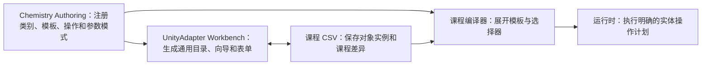

# 化学课程用品目录与抽象操作设计

**日期：** 2026-08-05

**状态：** 已确认

**范围：** Chemistry Sample 的课程创作能力，以及 UnityAdapter 为模块提供的通用创作界面

## 1. 背景

当前氧气课程需要作者同时理解 `实验对象.csv`、`交互规则.csv`、`学科过程.csv`、
`实验流程.csv`、`表现覆盖.csv` 等多张表。部分表达到 15 至 23 列，学科过程还使用
分号连接的参数串。新建课程向导只创建课程信息和实验对象两张基础表，现有工作台主要
支持对象能力编辑；交互特例、科学过程、教学目标、错误后果和表现仍要求作者直接打开
原始 CSV。因此，现有配置虽然可以编译，却没有形成从空白课程到可运行课程的完整创作
路径。

既有架构已经明确“创作模型面向人、编译模型面向运行时”，但阶段四的组件、选择器和
模板创作模型尚未真正落地。本设计完成这部分边界，不修改最小运行时内核的学科中立性。

## 2. 目标

- 课程作者可以从化学实验用品目录开始创建课程，不必先理解内部协议和全部 CSV 表头。
- Chemistry 自己声明用品类别、用品模板、抽象操作和参数模式。
- UnityAdapter 根据模块注册信息生成通用表单，不硬编码化学用品名称。
- 标准能力、规则和表现由模板自动展开，课程只填写实例差异和课程特例。
- Unity 只识别输入并执行物理与视觉表现，科学判断和权威状态仍由引擎及模块负责。
- 错误配置同时表达严重度、后续处理方式和受影响目标。
- CSV 继续作为唯一可审查、可版本控制的数据源，但不再是普通作者的主要入口。
- 迁移完成后删除旧表头、旧读取器和显示词典，不保留兼容分支。

## 3. 非目标

- 不在内核中增加“器皿”“药品”“工具”等固定枚举或继承体系。
- 不让用品模板保存模型预制体、材质、音频、粒子或 Addressables 引用。
- 不为每个操作对象创建独立预制体；课程继续使用一个实验总预制体。
- 不让 Unity 直接写物质库存、反应状态、教学目标或错误后果。
- 不在课程中允许自定义事实读取器、状态操作或过程执行代码。
- 不为旧配置格式提供双轨读取、版本后缀或内部协议兼容。

## 4. 总体架构

创作模型采用三层结构：

```text
用品类别 → 用品模板 → 能力组件
```

- 用品类别只负责编辑器导航和说明。
- 用品模板描述一种常见实验用品的默认能力、参数和操作。
- 能力组件决定对象实际具备的行为，模板不直接成为运行时行为分支。

模块与界面的依赖方向如下：



通用创作契约由 UnityAdapter 的 Editor 程序集拥有，Chemistry Authoring 实现提供者。
运行时程序集不引用这些编辑器定义。未来物理、生物等模块可以实现同一提供者接口，
无需修改工作台。

## 5. 化学实验用品目录

Chemistry 首批注册八个一级类别：

| 类别 | 典型用品 |
| --- | --- |
| 容器与反应器皿 | 试管、烧杯、集气瓶、试剂瓶、水槽 |
| 测量仪器 | 量筒、天平、温度计、滴定管 |
| 加热与点火设备 | 酒精灯、火柴、电热装置 |
| 支撑与夹持器材 | 铁架台、试管夹、试管架、升降台 |
| 连接与密封器材 | 橡胶塞、玻璃导管、软管、玻璃片 |
| 操作工具 | 药匙、镊子、坩埚钳、胶头滴管 |
| 药品与实验材料 | 高锰酸钾、木炭、石灰水、棉花、铁丝 |
| 安全、清洁与废弃设施 | 废液缸、防护用品、清洗用品 |

“学生”、教学目标、风险和课程里程碑不是实验用品，分别属于系统角色和教学语义。

### 5.1 类别定义

每个类别包含：

- 类型化类别标识；
- 中文名称；
- 面向作者的用途说明；
- 显示顺序。

类别标识由模块拥有并注册。工作台从注册信息显示名称，不维护翻译或展示词典。

### 5.2 用品模板定义

每个用品模板包含：

- 类型化模板标识；
- 所属类别标识；
- 中文名称和用途说明；
- 默认能力组件集合；
- 默认参数值；
- 作者必须填写的参数模式；
- 支持的抽象操作集合；
- 可选角色和标签建议。

用品模板不包含 Unity 类型和资源引用。模板标识直接使用稳定的自然中文，例如“试管”
“酒精灯”“铁架台试管夹”。

### 5.3 类别、类型与能力的区别

一个对象只有一个主类别和一个实体类型，但可以拥有多个角色、标签和能力。例如酒精灯
属于“加热与点火设备”，实体类型为“酒精灯”，同时具有热源、可点燃、可覆盖和可定位
等能力。规则只能读取能力、关系和权威状态，不能根据用品类别决定运行时行为。

## 6. 课程创作数据

课程作者看到的是工作台表单；CSV 是同一份数据的持久化形式。工作台直接读写 CSV，
不创建第二套 ScriptableObject 创作源。

### 6.1 `课程.csv`

```text
课程标识,显示名称,学科配方包,操作者实体标识,实验预制体
```

实验预制体只保存总预制体的逻辑加载路径。

### 6.2 `实验对象.csv`

```text
实体标识,显示名称,实体类型,角色列表,标签列表,初始位置,初始旋转
```

`实体类型` 对应用品模板。类别由模板推导，不在对象实例中重复保存。新增同类型对象只
新增实例行，例如第三块玻璃片不需要复制覆盖规则。

### 6.3 `组件.csv`

```text
组件标识,主体选择方式,主体选择值,组件类型,参数
```

该表只保存模板之外的组件增补和参数覆盖。选择方式限定为实体、类型、角色和标签。
工作台依据组件参数模式把 `参数` 渲染成独立字段；高级 CSV 编辑仍使用自然中文
`名称=值;名称=值` 形式，不允许内部操作 ID 或自由表达式。

### 6.4 `初始关系.csv`

```text
关系标识,关系类型,来源实体,目标实体,来源端口标识,目标端口标识
```

用于初始连接、覆盖、夹持和容器关系。关系类型和端口由模块注册并由工作台提供选择。

### 6.5 `操作特例.csv`

```text
特例标识,处理方式,操作,来源选择方式,来源选择值,目标选择方式,目标选择值,顺序,主体选择方式,主体选择值,事实,比较,值,单位,拒绝文案,后果模板
```

标准操作由模板生成，本表只记录禁用默认、收紧默认或允许并附加后果的课程差异。一行
表达一个条件；同一特例标识的多行按顺序组成条件组。`后果模板` 只能选择模块注册项，
课程不能填写状态操作协议。

### 6.6 `过程.csv`

```text
过程标识,过程类型,主体选择方式,主体选择值,来源选择方式,来源选择值,目标选择方式,目标选择值,参数
```

用于实例化倾倒、加热、反应等模块过程。过程参数由模块模式渲染和校验。

### 6.7 `教学.csv` 与 `教学条件.csv`

```text
教学项标识,类型,显示名称,触发类型,触发值,分值变化,提示文案,错误严重度,发生后如何继续,受影响目标
```

```text
教学项标识,顺序,主体选择方式,主体选择值,事实,比较,值,单位
```

目标、风险和评分信息与判断条件分开保存，避免继续使用一张 23 列的流程表。类型为目标
时错误字段留空；类型为风险时必须填写严重度、后续处理方式和受影响目标。

### 6.8 `表现.csv`

```text
表现标识,触发类型,触发值,主体选择方式,主体选择值,表现信号,作用位置,位置标识,参数
```

这里只保存表现语义和逻辑位置，不保存材质、音频、模型或逐对象预制体引用。

### 6.9 `验收场景.csv`

验收场景继续使用动作和断言记录，但只进入测试产物，不进入课程运行状态。普通作者由
工作台生成常用验收步骤，高级用户可以批量维护 CSV。

## 7. 课程工作台流程

Unity 课程工作台成为主要入口，按以下顺序引导作者：

1. **课程信息**：选择学科包、实验总预制体和操作者。
2. **实验用品**：按八类浏览用品模板，选择模板和数量并创建实例。
3. **装置与初始状态**：配置连接、覆盖、夹持、容器内容和初始位置。
4. **操作与科学过程**：查看模板自动生成的标准操作，只添加课程特例和过程参数。
5. **教学目标与错误后果**：使用句子式表单配置目标、风险、评分和后续处理。
6. **检查与生成**：修正诊断，预览展开结果，保存 CSV 并生成课程资产。

工作台默认不展示内部标识和原始列。每个区域提供“查看原始表”高级入口，Excel 与工作台
仍使用现有外部修改检测和原子保存机制，避免互相覆盖。

## 8. 抽象操作边界

Unity、最小内核和模块按以下方式分工：

| 层 | 职责 |
| --- | --- |
| UnityAdapter | 识别抓取、倾斜、接触和拖动；执行动画、约束跟随和视觉表现；报告开始、观测、完成或取消 |
| 最小内核 | 接收语义操作请求；编排判断、事务和操作生命周期；返回接受或拒绝 |
| Interaction/Chemistry | 注册操作、事实、判断和权威状态变化；计算物质转移、反应与错误后果 |
| 课程 | 选择操作模板并填写实例参数，不定义执行代码 |

### 8.1 操作请求与结果

操作请求包含操作标识、命令标识、操作者、来源、目标、输入参数和发生时刻。操作结果
包含接受状态、操作实例标识、拒绝原因、执行方式和表现信号。执行方式是模块注册的逻辑
标识，不是 Unity 类型名。

### 8.2 生命周期

- **即时操作**：揭盖、放置、连接。接受后立即提交权威状态，Unity 响应成功事件。
- **持续操作**：倾倒、加热。接受后创建过程实例，模块按时钟推进科学状态。
- **操纵操作**：移动酒精灯、调整试管夹。引擎批准操纵范围，Unity 执行移动并持续提供
  位置、角度等观测。

Unity 不能直接报告并写入“已经倒入十毫升”。它只能报告倾角、持续时间和结束意图；
Chemistry 根据流量、库存、容量和时间计算实际转移量。

### 8.3 夹取固体示例

Unity 检测药匙进入试剂瓶并提交“取出物质”意图。Chemistry 判断瓶盖关系、工具能力、
容器内容和可取数量；接受后扣减瓶内物质、增加药匙携带物质，并发出“工具内容变化”
表现信号。Unity 只负责显示药匙上的粉末。

## 9. 错误后果与后续处理

一次错误仍分为三个独立部分：

1. 动作判断：接受或拒绝；
2. 科学后果：世界状态、过程、样品或器材发生什么变化；
3. 教学投影：严重度、提示、分数、后续处理方式和受影响目标。

编辑器不再显示抽象的“可恢复性”，改为“发生后如何继续”。可选值为：

- 可以继续；
- 纠正后继续；
- 更换样品或器材后继续；
- 重新开始；
- 无法继续。

错误严重度独立选择“现象偏差”“实验风险”或“安全事故”。`受影响目标` 指向一个或
多个教学目标，也可以明确选择“整个实验”。因此系统能够表达“实验可以继续但性质验证
现象已经不正确”，也能够表达“当前动作造成事故，整个实验必须重新开始”。

## 10. 诊断要求

所有诊断都必须包含问题、原因和修复入口。例如：

```text
大试管选择了“可加热”，但没有可配对的热源。
[定位到大试管] [选择热源]
```

生成课程前至少检查：

- 类别、模板、组件、操作、过程和后果模板均已由所选模块注册；
- 实验总预制体中的实体标识没有缺失或重复；
- 所有必填参数符合类型、范围和单位模式；
- 配对标签确实生成预期操作，没有悬空来源或目标；
- 教学目标存在可达路径；
- 风险记录完整填写严重度、后续处理方式和受影响目标；
- 每种执行方式都存在 Unity 表现执行器；
- 配置不存在循环模板引用、重复标识或冲突覆盖。

## 11. 硬编码边界

- 通用工作台不维护化学用品、能力或参数的中文展示词典。
- 类别、模板、参数、操作和过程的中文名称随模块描述符注册。
- 课程引用类型化中文标识，不进行中英文协议翻译。
- 工作台可以保留少量真正通用的界面词汇，例如“课程”“保存”“生成”和“诊断”。
- Chemistry 可以在不修改 UnityAdapter 的情况下增加用品模板和操作模板。

## 12. 一次性迁移顺序

1. 在 UnityAdapter Editor 中建立通用类别、用品模板、参数模式和操作描述契约。
2. 让现有能力描述符直接携带中文名称和说明，删除工作台展示词典依赖。
3. 在 Chemistry Authoring 中注册八个类别和氧气课程所需的首批用品模板。
4. 扩展工作台，使其能够编辑用品、装置、操作、过程、教学、表现和验收配置。
5. 建立新 CSV 读取、写入和编译模型，并让模板展开为现有规范化课程模型。
6. 将氧气课程完整迁移到新表和新模板，重新生成课程资产。
7. 删除旧 `实验对象.csv` 动态横向参数列、旧 `交互规则.csv`、旧 `学科过程.csv`、
   旧 `实验流程.csv`、旧读取分支和 `CourseWorkbenchDisplayNames`。
8. 运行 Chemistry、UnityAdapter、引擎和氧气课程回归测试后分步提交。

迁移期间允许提交彼此可审查的小步骤，但分支最终状态只接受新格式；不增加版本后缀、
兼容读取或自动猜测旧字段。

## 13. 测试策略

需要保留的行为测试：

- 类别和模板注册的重复标识、缺失引用与确定性顺序；
- 模板默认组件、课程覆盖和选择器展开；
- 新建课程后通过工作台添加用品并成功编译；
- 总预制体实体绑定的缺失、重复和定位诊断；
- 即时、持续和操纵三类操作生命周期；
- Unity 只消费操作结果，不能直接写 Chemistry 权威状态；
- 倾倒和夹取固体的库存、容量、取消和错误路径；
- 错误严重度、后续处理方式和受影响目标的独立组合；
- 氧气课程既有正确路径和错误后果；
- CSV 外部修改检测、原子保存和编译确定性。

不编写窗口颜色、控件宽度、折叠状态、内部列表顺序或重复快照类测试。

## 14. 验收标准

- 新建课程后，作者无需打开 Excel 即可从用品目录创建第一组实验对象并生成课程。
- 选择“试管”模板会自动获得 Chemistry 注册的默认组件和操作。
- 作者界面不出现状态操作 ID、内部协议名或英文枚举值。
- 新增第三块玻璃片只新增对象实例，不复制覆盖规则。
- 新增 Chemistry 用品模板不修改 UnityAdapter 工作台代码。
- 没有 Unity 场景时，抽象操作和科学后果仍能进行无界面测试。
- Unity 的倾倒或夹持实现可以替换，而不修改课程 CSV、Chemistry 科学逻辑或内核。
- 错误能够分别表达“继续但现象错误”“纠正后继续”“更换后继续”“重新开始”和
  “无法继续”。
- 课程数据不保存逐对象预制体、材质、音频或其它表现资源引用。
- 仓库最终不存在旧配置读取器、旧表头兼容分支和工作台化学展示词典。
